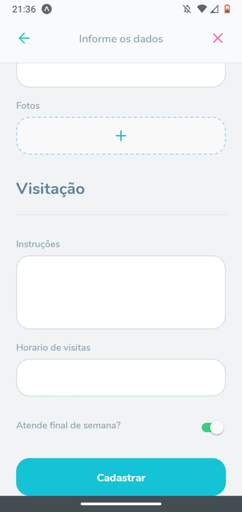

<h1 align="center">
  
</h1>

<h1 align="center">
  
  
</h1>

<h1 align="center">
  
  
</h1>

<p align="center">Aplicação para cadastro de orfanatos, informando como realizar uma visitação de</p>

---
## Tecnologias

- NodeJS
- ReactJS
- React Native
- SQLite
- TypeScript

## Pré-requisitos

- Instalar uma IDE (Visual Studio Code)
- Instalar o Node.JS

```bash
# Clone este repositório
$ git clone <https://github.com/RafaelSantinon/react-reactnative-node-nlw03>
```
---
```bash
# Na pasta backend

# Instalar as dependências
npm install

#Iniciar o projetos
npm dev
```
---
```bash
# Na pasta web

# Instalar as dependências
npm install

#Iniciar o projetos
npm start
```
## Rodando a aplicação

- Abrir um navegador e acessar localhost:3333
---
```bash
# Na pasta mobile

# Instalar as dependências
npm install

#Iniciar o projetos
npm dev
```
## Rodando a aplicação

- Baixar o aplicativo do expo na Store do celular e escanear o QR Code pelo aplicativo
---
### Autor

Feito por Rafael Novaes Santinon, junto a equipe da Rocketseat na Next Level Week edição 03. Entre em contato!